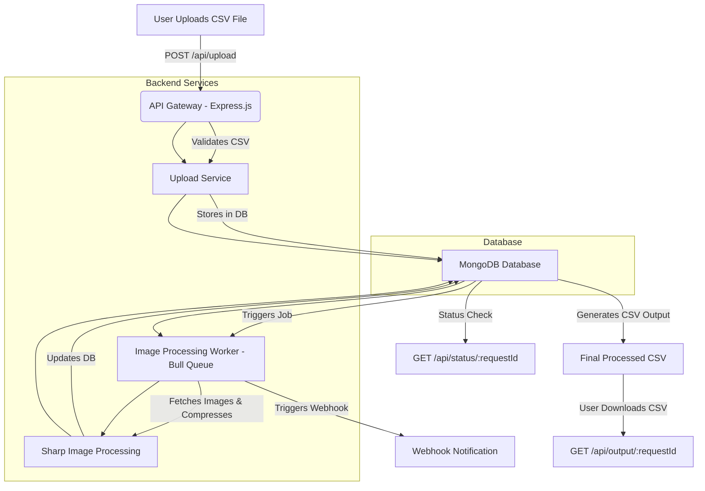

# 🚀 Image Processing System

## 📌 Overview
This project is a **CSV-based Image Processing System** that processes images asynchronously. It:
- Accepts a **CSV file** containing product names and image URLs.
- **Validates** the data format.
- **Compresses images** (reduces quality by 50%).
- **Stores processed image data** in a database.
- Provides a **unique request ID** for tracking.
- Offers an API to **check processing status**.
- **Generates an output CSV** with compressed image URLs.
- Supports **webhook integration** to notify after completion.

## 🔥 Features
✅ Upload CSV file (image URLs)  
✅ Validate CSV format  
✅ Asynchronous image processing (50% compression)  
✅ Store image data & product details in **MongoDB**  
✅ Unique request ID for tracking  
✅ Check processing status using API  
✅ Webhook notification on completion  
✅ Output CSV with processed images  
✅ **Swagger API Documentation**  
✅ **Deployed using Railway**  

## 🏗️ Tech Stack
- **Backend:** Node.js, Express.js, TypeScript
- **Database:** MongoDB (Mongoose ORM)
- **Image Processing:** Sharp
- **Queue Management:** Bull (Redis)
- **API Documentation:** Swagger
- **Deployment:** Railway

## 📂 Project Structure
```
📁 project-root
│── 📂 src
│   ├── 📂 routes            # API Routes
│   ├── 📂 controllers       # Business Logic
│   ├── 📂 services          # Image Processing Services
│   ├── 📂 workers           # Asynchronous Workers (Bull)
│   ├── 📂 models            # Mongoose Database Models
│   ├── 📂 utils             # Helpers (CSV Handling, Webhooks, etc.)
│── 📄 .env                  # Environment Variables
│── 📄 package.json          # Dependencies
│── 📄 README.md             # Documentation
│── 📄 tsconfig.json         # TypeScript Config
```

## 🔑 Environment Variables
Create a `.env` file in the project root with:
```env
PORT=5000
MONGO_URI=<your_mongodb_connection_string>
REDIS_URL=<your_redis_url>
JWT_SECRET=<your_jwt_secret>
WEBHOOK_URL=<your_webhook_url>
```

## 🚀 Installation & Setup
### **1️⃣ Clone the Repository**
```bash
git clone https://github.com/yourusername/yourrepo.git
cd yourrepo
```

### **2️⃣ Install Dependencies**
```bash
npm install
```

### **3️⃣ Start MongoDB & Redis**
If using **Docker**, run:
```bash
docker-compose up -d
```
Or manually start **MongoDB** and **Redis**.

### **4️⃣ Start the Server**
```bash
npm start
```

### **5️⃣ Run Worker for Image Processing**
```bash
npm run worker
```

## 🔥 API Endpoints
### **1️⃣ Upload CSV File**
**Endpoint:** `POST /api/upload`
```bash
curl -X POST http://localhost:5000/api/upload -F "file=@test.csv"
```
#### ✅ Response
```json
{
  "requestId": "12345-abcdef",
  "message": "File uploaded successfully"
}
```

### **2️⃣ Check Processing Status**
**Endpoint:** `GET /api/status/:requestId`
```bash
curl -X GET http://localhost:5000/api/status/12345-abcdef
```
#### ✅ Response
```json
{
  "requestId": "12345-abcdef",
  "status": "completed"
}
```

### **3️⃣ Download Output CSV**
**Output CSV Format:**
| Serial No | Product Name | Input Image URLs | Output Image URLs |
|-----------|-------------|------------------|------------------|
| 1 | SKU1 | input1.jpg, input2.jpg | output1.jpg, output2.jpg |

# 📌 Low-Level Design (LLD) - Spyne Image Processing API

## **🖥️ System Architecture Diagram**
Below is the **LLD diagram** representing the flow of the Spyne Image Processing API:




## 📜 Swagger API Docs
Access Swagger documentation at:
```
http://localhost:5000/api-docs
```

## 🚀 Deployment (Railway)
### **1️⃣ Deploy to Railway**
1. Create a **[Railway](https://railway.app/)** account.
2. Connect GitHub repository.
3. Set environment variables (`MONGO_URI`, `REDIS_URL`, etc.).
4. Deploy & get **Live API URL**.

## 📌 Next Steps
- [ ] Improve error handling
- [ ] Add user authentication
- [ ] Enhance monitoring (logging & metrics)

## 👨‍💻 Contributing
1. Fork the repo
2. Create a new branch (`feature-xyz`)
3. Commit changes & open a PR

## 🎯 License
MIT License. Free to use and modify.


